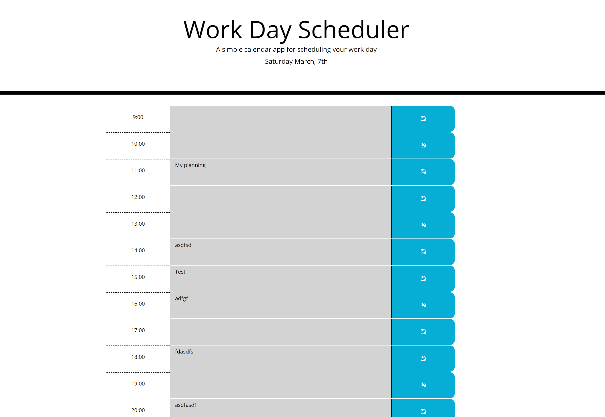

Third-Party APIs: Work Day Scheduler

# Description 

* This is a simple calendar application that allows the user to save events for each hour of the day. This app will run in the browser and feature dynamically updated HTML and CSS powered by jQuery.

# App Screenshot 

# Deployed url

* https://github.com/mandywl/05-day-planner-mandy
* https://mandywl.github.io/day-planner-mandy/

# Instructions

* The application displays timeblocks for standard business hours (9 a.m. to 5 p.m.)

* Each timeblock contains an input field and save button

* Clicking a time block's save button saves the input text to local storage, allowing the text to persist when the application is refreshed

* The current day is displayed at the top of the calendar

* Each timeblock is color coded to indicate whether it is in a past, present, or future hour
